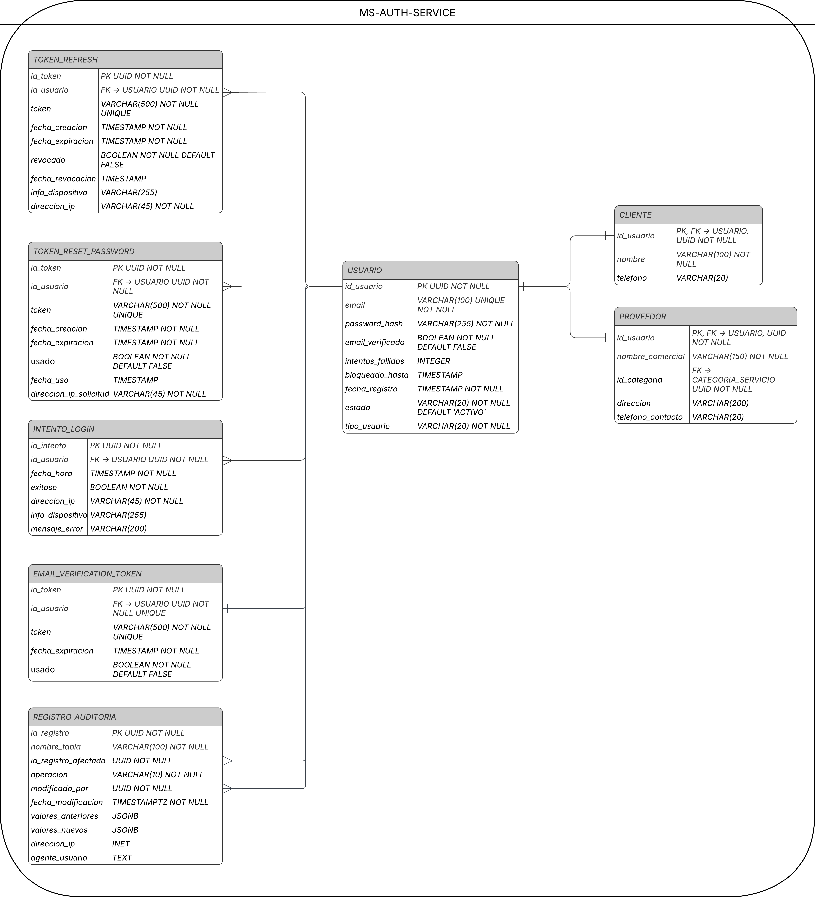

# Plataforma de Reservas de Servicios - MS-Auth-Service

[](https://github.com/Isa-Bedoya-UdeA/Reservas-MS-Auth-Service/actions/workflows/build.yml)
[](https://sonarcloud.io/summary/new_code?id=Isa-Bedoya-UdeA_Reservas-MS-Auth-Service)
[](https://sonarcloud.io/summary/new_code?id=Isa-Bedoya-UdeA_Reservas-MS-Auth-Service)
[](https://sonarcloud.io/summary/new_code?id=Isa-Bedoya-UdeA_Reservas-MS-Auth-Service)
[](https://sonarcloud.io/summary/new_code?id=Isa-Bedoya-UdeA_Reservas-MS-Auth-Service)
[](https://sonarcloud.io/summary/new_code?id=Isa-Bedoya-UdeA_Reservas-MS-Auth-Service)
[](https://sonarcloud.io/summary/new_code?id=Isa-Bedoya-UdeA_Reservas-MS-Auth-Service)

## Descripción

CodeF@ctory - Caso 15 - Plataforma de Reservas de Servicios - Microservicio de Autenticación y Usuarios.

## Responsabilidad

* Gestión de identidad
* Autenticación
* Autorización

## Tecnologías

### Backend

* **Java 17**
* **Spring Boot 3.5.13**
* **Spring Security** (Autenticación y autorización)
* **Spring Data JPA** (Persistencia)
* **JWT** (JSON Web Tokens para autenticación)
* **MapStruct** (Mapeo entre entidades y DTOs)
* **Lombok** (Reducción de código boilerplate)
* **Maven** (Gestión de dependencias)

### Herramientas de Desarrollo

* **Git** (Control de versiones)
* **GitHub** (Repositorio remoto)
* **Postman** (Pruebas de APIs)
* **SonarCloud** (Análisis de calidad de código)

## Requisitos Previos

Antes de ejecutar el proyecto, asegúrate de tener instalado:

* **JDK 17** o superior
* **Maven 3.8+**
* **Oracle Database** o **PostgreSQL**
* **Git**

## Instalación

### 1. Clonar el Repositorio

```bash
git clone https://github.com/Isa-Bedoya-UdeA/Reservas-MS-Auth-Service
cd Reservas-MS-Auth-Service
```

### 2. Configurar la Base de Datos y Propiedades

Copia el archivo `.env.example` a `.env`:

```bash
cp .env.example .env
```

Edita el archivo `.env` con tus credenciales de Supabase:

```bash
# SPRING PROFILE
SPRING_PROFILE=dev

# DATABASE CONFIG - SUPABASE (Transaction Pooler - IPv4 compatible)
DB_URL=jdbc:postgresql://aws-1-us-west-2.pooler.supabase.com:6543/postgres?sslmode=require&prepareThreshold=0
DB_USER=postgres.[TU-PROJECT-REF]
DB_PASSWORD=[TU-CONTRASEÑA-DE-SUPABASE]

# EXTERNAL SERVICES URLs
SERVICES_CATALOG_URL=http://localhost:8082
```

### 3. Configurar JWT

Genera un JWT_SECRET seguro:

```bash
openssl rand -base64 64
```

Agrega el JWT_SECRET generado a tu archivo `.env`:

```bash
JWT_SECRET=[TU-JWT-SECRET-SEGURA]
JWT_EXPIRATION=86400000
```

> **IMPORTANTE:** El JWT_SECRET debe ser el mismo en todos los microservicios.

### 4. Compilar el Proyecto

```bash
# Limpia el target y compila
Remove-Item -Recurse -Force target -ErrorAction SilentlyContinue
mvn clean compile
```

### 5. Ejecutar la Aplicación

```bash
mvn spring-boot:run
```

> **IMPORTANTE:** Para el correcto funcionamiento, debes tener corriendo ambos microservicios:
> - Auth Service (puerto 8081)
> - Catalog Service (puerto 8082)

La aplicación estará disponible en: `http://localhost:8081`

## Estructura del Proyecto

```
Reservas-MS-Auth-Service/
├── src/
│   ├── main/
│   │   ├── java/com/codefactory/reservasmsauthservice/
│   │   │   ├── client/              # Feign Clients para comunicación entre microservicios
│   │   │   ├── config/              # Configuración de Spring (Security, JWT, etc.)
│   │   │   ├── controller/          # Controladores REST (Auth, Verification, Health)
│   │   │   ├── dto/                 # Data Transfer Objects (Request y Response)
│   │   │   ├── entity/              # Entidades JPA (User, Client, Provider)
│   │   │   ├── exception/           # Excepciones personalizadas y manejo global
│   │   │   ├── mapper/              # Mapeadores (MapStruct) entre entidades y DTOs
│   │   │   ├── repository/          # Repositorios Spring Data JPA
│   │   │   ├── security/            # Seguridad (JWT filter, user details)
│   │   │   ├── service/             # Interfaces de servicios
│   │   │   └── service/impl/        # Implementaciones de servicios
│   │   └── resources/
│   │       ├── application.properties
│   │       ├── application-dev.properties
│   │       ├── application-prod.properties
│   │       └── application-test.properties
│   └── test/
│       └── java/                    # Tests unitarios y de integración
├── docs/                            # Diagramas y documentación arquitectónica
├── .env.example                     # Plantilla de variables de entorno
├── .env                             # Variables de entorno (no versionado)
├── pom.xml                          # Configuración de Maven
└── README.md
```

## Endpoints Principales

### Health Check
- `GET /api/`: Health Check - Retorna estado del servicio
- `GET /api/version`: Version Check - Retorna versión del servicio

### Registro de Usuarios
- `POST /api/auth/register/client`: Registrar un nuevo cliente
- `POST /api/auth/register/provider`: Registrar un nuevo proveedor

### Verificación de Email
- `POST /api/auth/verify-email`: Verificar email del usuario usando token
- `POST /api/auth/resend-verification-email`: Reenviar token de verificación

## Relaciones entre Entidades

- **User**: Entidad base con email, password y rol
- **Client**: Extiende de User, representa a un cliente que reserva servicios
- **Provider**: Extiende de User, representa a un proveedor que ofrece servicios
- **EmailVerificationToken**: Token para verificación de email, asociado a un User

## Diagramas

### Diagrama del Modelo de Dominio
[docs/domain-model.png]
(Pendiente)

### Diagrama de Arquitectura C4
[docs/architecture-c4.png]
(Pendiente)

### Diagrama de Componentes
[docs/components.png]
(Pendiente)

### Diagrama de Secuencia
[docs/sequence.png]
(Pendiente)

### Diagrama MER Lógico


### ADRs (Architecture Decision Records)
[docs/adrs/]
(Pendiente)

### Documentación de API (Swagger/OpenAPI)
[docs/swagger.png]
(Pendiente)

### Variables de Entorno para Despliegue
[docs/environment-variables.md]
(Pendiente)

## Pruebas en Postman

Para ver todos los ejemplos de pruebas en Postman, incluyendo registro de usuarios y verificación de email, consulta el archivo: **[docs/PruebasPostman.md](docs/PruebasPostman.md)**